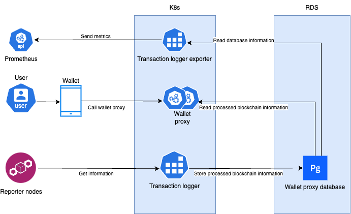

 # wallet-proxy

[](https://github.com/Concordium/.github/blob/main/.github/CODE_OF_CONDUCT.md)

## Component Interaction Diagram



## Overview

The wallet proxy provides the following endpoints:

* `GET /v0/accBalance/{account address}`: get the ccd balance on an account
* `GET /v1/accBalance/{account address}`: get the ccd balance on an account (including
  cooldowns and the available balance).
* `GET /v2/accBalance/{account address}`: get the ccd and plt (protocol level token) balances on an account (including 
cooldowns and the available balance) and get the info if an account is on any allow/deny list of any plt.
* `GET /v0/accNonce/{account address}`: get the next nonce for an account
* `GET /v0/accEncryptionKey/{account address}`: get the public encryption key of
  the account
* `GET /v0/transactionCost`: get the cost of a transaction
* `GET /v0/submissionStatus/{transactionHash OR submissionId}`: get the status
  of a transfer or credential deployment
* `PUT /v0/submitCredential`: deploy a credential/create an account
* `PUT /v0/submitTransfer`: perform a simple transfer
* `PUT /v0/submitRawTransaction`: perform a any raw transaction
* `GET /v0/accTransactions/{account address}`: get the transactions affecting an account's ccd balance
* `GET /v1/accTransactions/{account address}`: get the transactions affecting an account's ccd balance (including transactions with memos)
* `GET /v2/accTransactions/{account address}`: get the transactions affecting an account's ccd balance (including special transaction outcomes for suspended/inactive validators and including transactions with memos)
* `GET /v3/accTransactions/{account address}`: get the transactions affecting an account's ccd or plt balances (including special transaction outcomes for suspended/inactive validators and including transactions with memos)

* `PUT /v0/testnetGTUDrop/{account address}`: request a CCD drop to the specified account
* `GET /v0/health`: get a response specifying if the wallet proxy is up to date
* `GET /v0/global`: get the cryptographic parameters obtained from the node it is connected to
* `GET /v0/ip_info`: get the identity providers information with links for submitting initial identity issuance requests.
* `GET /v1/ip_info`: get the identity providers information with links for submitting identity issuance and recovery requests.
* `GET /v2/ip_info`: get the identity providers information (including company ID providers) with for submitting identity issuance and recovery requests.
* `GET /v0/bakerPool/{bakerId}`: get the status of a baker pool given the baker ID.
* `GET /v0/chainParameters`: get the chain parameters.
* `GET /v0/nextPayday`: get the next payday.
* `GET /v0/passiveDelegation`: get the status of passive delegation.
* `GET /v0/appSettings`: get the up-to-date status of the old mobile wallet app.
* `GET /v0/termsAndConditionsVersion`: get the latest version of terms and conditions.
* `GET /v1/appSettings`: get the up-to-date status of the new mobile wallet app.
* `GET /v0/epochLength`: get the epoch length in milliseconds.
* `GET /v0/CIS2Tokens/{index}/{subindex}`: get the list of tokens on a given contract address.
* `GET /v0/CIS2TokenMetadata/{index}/{subindex}`: get the metadata of tokens in on given contract address.
* `GET /v0/CIS2TokenBalance/{index}/{subindex}/{account address}`: get the balance of tokens on given contract address for a given account address.
* `GET /v1/CIS2TokenMetadata/{index}/{subindex}`: get the metadata of tokens on given contract address, ignoring failing requests.
* `GET /v1/CIS2TokenBalance/{index}/{subindex}/{account address}`: get the balance of tokens on given contract address for a given account address, ignoring failing requests.
* `GET /v0/plt/tokens`: get the list of all plt tokens.
* `GET /v0/plt/tokenInfoRaw/{tokenId}`: get info about a given plt token and its raw module state (CBOR encoded).
* `GET /v0/plt/tokenInfo/{tokenId}`: get info about a given plt token and its module state (with metadata url).

### Errors

In case of a non 200 return code the return value will always be a JSON object with two fields
```json
{
  "errorMessage": "free form string",
  "error": Int
}
```

Where the error codes currently returned are
- 0 for internal server error, most likely the server could not communicate with the node:
  ```json
  {"error":0,"errorMessage":"Error accessing the GRPC endpoint"}
  ```
- 1 for when the request is invalid. There can be a number of reasons for this, but most of them
  should not occur once the initial debugging is over. They indicate that data is malformed in one
  way or another. The message will usually pinpoint the cause of the error.
  ```json
  {"error":1,"errorMessage":"Malformed transaction hash."}
  ```
- 2 for when the request is well-formed, but the requested object could not be
  found, e.g., the account does not exist in the expected place.

### Language & localization

Error messages and textual descriptions will be localized by the proxy based on the `Accept-Language` header.
(Currently, only `en` is available.)
Languages can also be specified with the `_LANG` GET-parameter and/or a `_LANG` cookie; these have higher precedence than `Accept-Language`.

## Identity provider information

The data served on the `v0/ip_info` endpoint is a JSON array of objects. Each
object is of the form
```json
{
    "ipInfo": {...},
    "arsInfos": {...},
    "metadata": {
        "issuanceStart": URL,
        "icon": "base64 encoded png image"
    }
}
```
All fields are mandatory.
The "ipInfo" and "arsInfos" objects are needed when creating identity object requests, and identity objects.

## Account Balance

The balance on an account can be queried as in the following example:

```console
$ curl -XGET localhost:3000/v0/accBalance/4WHFD3crVQekY5KTJ653LHhNLmTpbby1A7WWbN32W4FhYNeNu8
```

```json
{"currentBalance":AccountBalance,"finalizedBalance":AccountBalance}
```

Or (v1):
```console
$ curl -XGET localhost:3000/v1/accBalance/4WHFD3crVQekY5KTJ653LHhNLmTpbby1A7WWbN32W4FhYNeNu8
```

```json
{"finalizedBalance":AccountBalance}
```

Or (v2):
```console
$ curl -XGET localhost:3000/v2/accBalance/4WHFD3crVQekY5KTJ653LHhNLmTpbby1A7WWbN32W4FhYNeNu8
```

```json
{
    "accountAmount": "29999999952730",
    "accountAvailableAmount": "29999999952730",
    "accountCooldowns": [],
    "accountTokens": [
        {
            "tokenAccountState": {
                "balance": 9.99999999999401e12,
                "inAllowList": false,
                "inDenyList": true
            },
            "tokenId": "PLT"
        }
    ]
}
```

The result is a JSON object with two __optional__ fields:
- `currentBalance` (v0 only) is the balance on the account in the current best block;
- `finalizedBalance` is the balance on the account in the most recently finalized block.

For the `v1` endpoint, only `finalizedBalance` is ever present.
If it is absent, the account has not yet been finalized on the chain.

For the `v0` endpoint, if neither field is present, then the account does not currently exist on the chain.
If only `currentBalance` is present, then the account has been created, but its creation has not yet been finalized.
Otherwise, both fields will appear.

The `AccountBalance` value is always an object with the following fields
* `"accountAmount"` (required) which is an Amount type, i.e., a string containing an integral value.
  This amount represents the total amount owned by the account, no matter if it is locked up or not.
  It does not however include the encrypted amounts. To compute the available amount we have to calculate:
  `accountAmount - lockedUpBalance` (from the last point of this list).
* `"accountEncryptedAmount"` (required) which is an object with three (mandatory) fields
  - `"selfAmount"` of type EncryptedAmount, i.e., a hexadecimal string
  - `"startIndex"` a non-negative 64-bit integer
  - `"numAggregated"` (optional) a number >= 2 indicating how many amounts
    are aggregated together in the first amount (see section at the end for an
    explanation). If not present the first amount in the list is a pure incoming amount.
  - `"incomingAmounts"` an array of `EncryptedAmount` values, i.e., an array of
    hexadecimal strings. The array could be empty, but is always present.
* `"accountNonce"` the nonce of the account matching the balance. This is the
  nonce of the next transaction that is not yet included in the balance.
* `"accountReleaseSchedule"` (required) the release schedule for this account consisting of:
  - `"schedule"`: a list of objects with the following fields, all required
    * `"timestamp"` (in milliseconds since Unix Epoch)
    * `"amount"` .. the amount that will be released at the given timestamp
    * `"transactions"` .. an array of transaction hashes that contribute to
      the amount that will be released.

  - `"total"`: The sum of all the pending amounts, to be used when calculating the available amount.
  More explicitly, the format of `"accountReleaseSchedule"` is:
  ```
    { "schedule": [
        [ timestamp1, [ amount1, [ txHash11, txHash12...] ] ],
        [ timestamp2, [ amount2, [ txHash21...] ] ],
        ...
        ],
      "total" : totalamount
    }
  ```
* `"accountIndex"`(required) the index of the account.
* `"accountBaker"` (optional) if present indicates that this account is
  registered as a baker. If present, the value is always an object with fields
  - `"stakedAmount"` (required): the amount that is currently staked
  - `"bakerId"` (required): the baker id the account is registered as
  - `"restakeEarnings"` (required): a boolean indicating whether earnings are
    added to stake.
  - `"bakerAggregationVerifyKey"` (required): public key to verify aggregate signatures in which the baker participates.
  - `"bakerElectionVerifyKey"` (required): public key to verify the baker has won the election.
  - `"bakerSignatureVerifyKey"` (required): public key to verify block signatures signed by the baker.
  - `"pendingChange"` (optional): if present indicates that the baker is in a cooldown due to removal or a change of stake.
    If present, the value is an object with the fields
    * `"change"` (required): indicating the kind of change which value is either `"reduceStake"` indicating that the
      baker's stake is reduced at the end of the cooldown period, or `"removeStake"` indicating that the baker is being
      removed at the end of the cooldown period.
    * `"effectiveTime"` (required): the time at which the cooldown ends, e.g. `"2022-03-30T16:43:53.5Z"`.
    * `"estimatedChangeTime"` (optional, present if protocol version 4 or
      later): an estimate of when the change actually takes effect, which is the
      first payday after the cooldown ends, e.g. `"2022-03-30T16:43:53.5Z"`.
    * `"newStake"` (optional): This field is present if the value of the field `"change"` is `"reduceStake"`,
        and the value is the new stake after the cooldown.
  - `"isSuspended"` (required, historically absent): `true` if the validator is supended, `false` otherwise.
    This is always `false` prior to protocol version 8.
  - `"isPrimedForSuspension"` (optional): this is present if the validator is in the committee for the current reward period, and is `true` if it is currently primed for suspension at the next snapshot, and `false` otherwise. Absent prior to protocol version 8.
* `"accountDelegation"` (optional) if present indicates that this account is
  registered as a delegator. If present, the value is always an object with fields
  - `"stakedAmount"` (required): the amount that is currently staked
  - `"restakeEarnings"` (required): a boolean indicating whether earnings are
  - `"delegationTarget"` (required): the delegation target consisting of
    * `"delegateType"` (required): the type of delegation which value is either `"Passive"` or `"Baker"`
    * `"bakerId"` (optional): If the value `"delegateType"` is `"Baker"`, then `"bakerId"` is the ID of the target pool,
       otherwise not present.
  - `"pendingChange"` (optional): if present indicates that the delegator is in a cooldown due to removal or a change of stake.
    If present, the value is an object with the fields
    * `"change"` (required): indicating the kind of change which value is either `"reduceStake"` indicating that the
      delegators's stake is reduced at the end of the cooldown period, or `"removeStake"` indicating that the delegator is being
      removed at the end of the cooldown period.
    * `"effectiveTime"` (required): the time at which the cooldown ends, e.g. `"2022-03-30T16:43:53.5Z"`.
    * `"estimatedChangeTime"` (optional, present if protocol version 4 or
      later): an estimate of when the change actually takes effect, which is the
      first payday after the cooldown ends, e.g. `"2022-03-30T16:43:53.5Z"`.
    * `"newStake"` (optional): This field is present if the value of the field `"change"` is `"reduceStake"`,
        and the value is the new stake after the cooldown.
  - `"isSuspended"` (optional, should always be present after protocol 8): `true` if the target validator is suspended, `false` otherwise.
  - `"isPrimedForSuspension"` (optional): this is present if the validator is in the committee for the current reward period, and is `true` if it is currently primed for suspension at the next snapshot, and `false` otherwise.
* `"accountCooldowns"` (v1 only, required): an array (possibly empty) of cooldown amounts in the account's inactive stake.
  Each entry consists of the following fields:
  - `"timestamp"`: the timestamp at which the cooldown is expected to expire
  - `"amount"`: the amount of cooldown stake expiring at this time
  - `"status"`: the status of this cooldown entry; one of the following values:
    * `"cooldown"`: the stake is no longer effective for the current payday, and will become available at the specified time.
    * `"precooldown"`: the stake may still be effective for the current payday, and will begin cooldown at the next payday, and is expected to become available at the specified time.
    * `"preprecooldown"`: the stake may still be effective for the current payday, and will enter precooldown at the next snapshot epoch (i.e. one epoch before the payday), and is expected to become available at the specified time.
* `"accountAtDisposal"` (v1 only, required): the balance of the account that is available to be spent or transferred, accounting for any stake (active or inactive) and locked balance.

## Account Nonce

When making a transfer the wallet must select a nonce for the transaction. This nonce must be sequential.
The server provides a "best effort" functionality for querying the nonce. This is on the endpoint `accNonce`
which will always return a JSON object (unless there is an internal server error) consisting of two fields
```json
{
  "nonce": UInt,
  "allFinal": Bool
}
```

Example:
```console
$ curl -XGET localhost:3000/v0/accNonce/4WHFD3crVQekY5KTJ653LHhNLmTpbby1A7WWbN32W4FhYNeNu8
{"allFinal":true,"nonce":3}
```

The `nonce` is always the next nonce that should be used provided all the known transactions will be finalized eventually.
- If `allFinal` is `True` then all transactions from this account are finalized and the nonce should be considered reliable.
- Otherwise there are some pending transactions so the nonce returned is a best guess assuming all transactions will be successful.

In case the wallet is the only user of the account then this nonce tracking is reliable.
If there are other concurrent users of the account then there is a chance the
nonce returned will be wrong, but then it is up to the user to keep track of that themselves.

## Account Encryption key

Returns the public key of the account that can be used when making encrypted
transfers. If the request is invalid, i.e., malformed address, the status code
in 500+ range is returned, if the request is valid, but the account does not
exist, a status code 404 is returned. In both these cases the returned object is
of the form of a generic error object, described above.

In case of success, the return code is 200, and the return value is an object of
the form

```json
{
  "accountEncryptionKey": String,
}
```
The field is mandatory, and the value will always be a hex-encoded public key.

## Transaction cost.

The cost for a transaction, both in energy and CCD is obtained on the
`v0/transactionCost` endpoint.
The following query parameters are supported
- `type`, the type of the transaction. This is mandatory and can be one of
  - `simpleTransfer`,
  - `encryptedTransfer`,
  - `transferToSecret`,
  - `transferToPublic`,
  - `registerDelegation`,
  - `updateDelegation`,
  - `removeDelegation`,
  - `registerBaker`,
  - `updateBakerStake`,
  - `updateBakerPool`,
  - `update`,
  - `updateBakerKeys`,
  - `removeBaker`, or
  - `configureBaker`.
- `numSignatures`, the number of signatures on the transaction, defaults to 1 if not present.
- `memoSize`, the size of the transfer memo. Optionaly, and only supported if the node is running protocol version 2 or higher, and only applies when `type` is either `simpleTransfer` and `encryptedTransfer`.
- `amount`, optionally when `type` is either `updateDelegation`, `updateBakerStake` and `configureBaker`, in which it specifies whether the staked amount is updated. When `type` is `update` it is mandatory and specifies the amount that is sent to the smart contract.
- `restake`, whether it is updated to restake earnings. Optionally, and only applies when `type` is either `updateDelegation`, `updateBakerStake` and `configureBaker`.
- `passive`, whether the delegation target is set to passive delegation. Optionally, and only applies when `type` is either `registerDelegation` or `updateDelegation`.
- `target`, whether the delegation target is updated. Optionally, and only applies when `type` is `updateDelegation`.
- `metadataSize`, the size of the metadata url of a baker pool. Optionally, and only applies when `type` is either `registerBaker`, `updateBakerPool` or `configureBaker`. If not present when `type` is `registerBaker`, the maximum url size is used in the cost calculation. If not present when `type` is `updateBakerPool` or `configureBaker`, it is assumed that the metadata url is not updated.
- `openStatus`, whether the open status of a baker pool is updated. Optionally, and only applies when `type` is either `updateBakerPool` or `configureBaker`.
- `transactionCommission`, whether the transaction fee commission of a baker pool is updated. Optionally, and only applies when `type` is either `updateBakerPool` or `configureBaker`.
- `bakerRewardCommission`, whether the baker reward commission of a baker pool is updated. Optionally, and only applies when `type` is either `updateBakerPool` or `configureBaker`.
- `finalizationRewardCommission`, whether the finalization reward of a baker pool is updated. Optionally, and only applies when `type` is either `updateBakerPool` or `configureBaker`.
- `suspended`, whether the suspended status of the validator is updated. Optionally, and only applies when `type` is `configureBaker`.
- `sender`, only applies when `type` is `update` and is mandatory in this case. Specifies the sender account address of the transaction.
- `contractIndex`, only applies when `type` is `update` and is mandatory in this case. Specifies the smart contract index of the contract being updated. Given as an integer.
- `contractSubindex`, only applies when `type` is `update` and is mandatory in this case. Specifies the smart contract subindex of the contract being updated. Given as an integer.
- `receiveName`, only applies when `type` is `update` and is mandatory in this case. Specifies the smart contract receive name of the smart contract receive function being called.
- `parameter`, only applies when `type` is `update` and is mandatory in this case. Specifies the smart contract parameter passed to the receive function. Given as a hex string.
- `executionNRGBuffer`, optionally and only applies when `type` is `update`. Specifies a buffer in percentage of how much of the energy for invoking the contract should be added to the returned cost. Given as an   integer. If not provided, a default of 20% is used.

Notice that when `type` is `configureBaker`, the cost of all possible "configure baker" transactions can be calculated. This means for instance that `/v0/transactionCost?type=updateBakerKeys` and `/v0/transactionCost?type=configureBaker&keys` would yield the same JSON output.

In case of success the response will always be a JSON object with required fields
- `"cost"` which is an Amount of CCD this transfer will cost at current
  conversion rates
- `"energy"` which is the energy that is required be supplied for execution of this transaction.
An optional `success` field is present if the `type` is `update` and all of the
supplied parameters are provided. It is a boolean that indicates whether the
contract invocation was successful, or whether contract execution failed.

In case of invalid parameters the response will be as described in the [errors section](#errors) with the following possible status codes
- `400` if any of the following apply
  - the transaction type parameter is missing
  - numSignatures is present but it cannot be parsed as an integer
  - memoSize is present but it cannot be parsed as an integer
  - `type` is `update` and at least one of `amount`, `sender`, `contractIndex`, `contractSubindex`, `receiveName`, `parameter` are missing or cannot be parsed.
- `404` if `memoSize` is present, but the node that backs the wallet-proxy is still running protocol version 1.
- `502` if the wallet-proxy cannot access the node.

### Example
An example for getting the cost of updating a smart contract:
```console
curl -XGET "http://localhost:3000/v0/transactionCost?type=update&contractIndex=1370&contractSubindex=0&amount=0&receiveName=CIS1-NFT.mint&parameter=00780d6c0578c685f54cca7c6713fcd290e6d5828bdc660bcc647750122e76ffd8010103&sender=3PWV7p3CVBNv1jBXCWMofUVkzX1zcJB6XyhVWFi1PdpoQUvsXu&executionNRGBuffer=10"
{"cost":"4778591","energy":2872}
```
In this example a buffer of 10% was used.

## Submission Status

A GET request to `/submissionStatus/{transactionHash OR submissionId}` returns a
JSON object summarizing the status of a transfer or credential deployment.
On success, the response is of the following form:
```
{
  "status": "finalized",
  "amount": "20000",
  "sender": "4WHFD3crVQekY5KTJ653LHhNLmTpbby1A7WWbN32W4FhYNeNu8",
  "to": "3J6vgTViNgjc4gxSgTkZWa2aspuitVCRrkkaTqQjFXHnkENaSk",
  "cost": 165,
  "transactionHash": "52277a488216a8914bf3d575a644a98b5592b62da2b91a45ca16302478e0583a",
  "outcome": "success",
  "blockHashes": [
    "b8b24624ca089a31a63afd5934a666c7a8e198c1e18970721ff0cf8b606fc16d"
  ]
}
```
Only the `status` field is required.
Other fields are present depending on the value of the `status` field and the type and result of the transaction.

#### `status` (required)
One of the following values:
* `"absent"`: the transaction is not known to the node
* `"received"`: the transaction has been received but not yet added to any block
* `"committed"`: the transaction is present in one or more blocks, but not a finalized block
* `"finalized"`: the transaction is present in a finalized block

If a submission is finalized it will always stay finalized. A received
transaction can transition into either committed, directly to finalized, or to
absent. A transaction that is committed is most likely going to transition to a
finalized one, although it is technically possible that it will become absent as well.

#### `outcome` (optional)
This field is present if the `status` field is `committed` or `finalized`.
The possible values are:
* `"success"`: the transaction completed successfully
* `"reject"`: the transaction failed
* `"ambiguous"`: the transaction has different outcomes in different blocks

The `ambiguous` outcome only applies to `committed` transactions.

#### `rejectReason` (optional)
This field is present if `outcome` is `reject`.
It contains a description of the reason for rejection.

#### `transactionHash` (optional)
This field is present if the `status` field is `committed` or `finalized`, and the `outcome` field is not `ambiguous`.
The value is the hash of the transaction.

#### `sender` (optional)
This field is present if the `status` field is `committed` or `finalized`, and the `outcome` field is not `ambiguous`.
The value is either the account address of the sender for a simple transfer, or `null` for a credential deployment.

#### `cost` (optional)
This field is present if the `status` field is `committed` or `finalized`, and the `outcome` field is not `ambiguous`.
The value is a number representing the actual cost of the transaction to the sender.
(The value is an integer in the smallest denomination of CCD.)

#### `to` (optional)
This field is present if the `status` field is `committed` or `finalized`, the `outcome` field is `success`, and the transaction is a simple or encrypted transfer.
The value is the account address of the recipient of the transfer.

#### `amount` (optional)
This field is present if the `status` field is `committed` or `finalized`, and the `outcome` field is `success`, and the transaction is a simple transfer or a `InitContract`.
In case of a simple transfer, the value is a number representing the amount transferred from the sender to the recipient. In the case of a `InitContract`, the value is a number representing the amount the contract is initialized with. This is the amount that is transferred from the sender account to the contract.
(The value is an integer in the smallest denomination of CCD.)

#### `blockHashes`
This field is present if the `status` field is `committed` or `finalized`.
The value is a (non-empty) array of the hashes of all (live) blocks in which the transaction appears.
If the `status` is `finalized`, the array will only have one element.

#### `newSelfEncryptedAmount` (optional)
This field is present if the `status` field is `committed` or `finalized`, and the `outcome` field is `success`, and the transaction is one of the three encrypted transactions. The value is the new self encrypted amount on the account.

#### `inputEncryptedAmount` (optional)
This field is present if the `status` field is `committed` or `finalized`, and
the outcome field is `success`, and the transaction is either an encrypted
transfer, or encrypted to public transfer, i.e., unshielding. The value is the
input encrypted amount that was removed from the sender's account.

#### `aggregatedIndex` (optional)
This field is present if the `status` field is `committed` or `finalized`, and the `outcome` field is `success`, and the transaction is either `EncryptedAmountTransfer` or `TransferToPublic`. The value is the index up to which the self encrypted amounts have been combined during the operation that was performed.

#### `amountAdded`/`amountSubtracted` (optional)
This field is present if the `status` field is `committed` or `finalized`, and the `outcome` field is `success`, and the transaction is either `TransferToPublic` or `TransferToEncrypted`. For a `TransferToPublic`, the field will be named `amountAdded` and it represents the plaintext amount that is added to the public balance of the sender. For a `TransferToEncrypted`, the field will be named `amountSubtracted` and it represents the plaintext amount that is subtracted from the public balance of the sender.

#### `moduleRef` (optional)
This field is present if the `status` field is `committed` or `finalized`, and the `outcome` field is `success`, and the transaction is either `DeployModule` or `InitContract`. The value is either the module reference of the deployed module or the module reference from which a contract was initializad.

#### `address` (optional)
This field is present if the `status` field is `committed` or `finalized`, and the `outcome` field is `success`, and the transaction is `InitContract`. The value is the contract address of the initialized contract.

#### `initName` (optional)
This field is present if the `status` field is `committed` or `finalized`, and the `outcome` field is `success`, and the transaction is `InitContract`. The value is the name of the contract init function being called.

#### `contractVersion` (optional)
This field is present if the `status` field is `committed` or `finalized`, and the `outcome` field is `success`, and the transaction is `InitContract`. The value is the version of the contract that was initialized.

#### `events` (optional)
This field is present if the `status` field is `committed` or `finalized`, and the `outcome` field is `success`, and the transaction is `InitContract`. The value is a list of contract events, given as hex strings.

#### `trace` (optional)
This field is present if the `status` field is `committed` or `finalized`, and the `outcome` field is `success`, and the transaction is `Update`. The value is a list of elements with the following fields:
- `"type"` - the event type. The possible values are `"updated"`, `"transferred"`, `"interrupted"` and `"resumed"`
- if the value of the `"type"` field is `"updated"`, the following additional fields are present:
  - `"address"` - the address of the contract that was updated,
  - `"instigator"` - the address of the instigator of the update, i.e. source of the message, an account or contract (this will differ from the sender of the transaction in nested transactons),
  - `"amount"` - the amount that was transferred to the contract and subtracted from the instigator,
  - `"message"` - the message that was sent to the contract given as a hex string,
  - `"receiveName"` - the name of the contract receive function that was called,
  - `"contractVersion"` - version of the contract that was updated,
  - `"events"` - a list of contract events, given as hex strings.
- if the value of the `"type"` field is `"transferred"`, the following additional fields are present:
  - `"from"` - the contract address of the contract that the amount was sent from,
  - `"amount"` - the amount,
  - `"to"` - the account address that the amount was sent to.
- if the value of the `"type"` field is `"interrupted"`, the following additional fields are present:
  - `"address"` - the contract address of the contract that was interrupted,
  - `"events"` - a list of contract events, given as hex strings.
- if the value of the `"type"` field is `"resumed"`, the following additional fields are present:
  - `"address"` - the contract address of the contract that was resumed,
  - `"success"` - a bool indicating whether the operation that was invoked succeeded.

## Credential deployment/account creation

Using either the example credential in [examples/cdi.json](examples/cdi.json) or
the initial account creation transaction in [examples/initial-account.json](examples/initial-account.json)
the following displays an interaction that leads to credential deployment.

```console
$ curl -XPUT -d "@examples/cdi.json" localhost:3000/v0/submitCredential
{
  "submissionId": "af8d639191fa6194c0ff285bcedb1f47b8b05ca477aae68dae26e1c524e06888"
}
```

If the credential is well-formed and communication with the server is good, and
the node is alive the server will respond with a submission id which can be
queried via the `/submissionStatus` endpoint.


## Submit transfer

When submitting a transfer you should make a PUT request to `/v0/submitTransfer` endpoint.
The data that should be sent is as the one returned from the library provided as part of the concordium-base repository.
After submission of the transaction the responses are the same as for the submission of the credential. If successful
a submission id is returned, which can be used to query the status of the transfer via the `/v0/submissionStatus` endpoint.


## Submit raw transaction

When submitting a raw transaction you should make a PUT request to `/v0/submitRawTransaction` endpoint.
The data that should be sent is the serialization of the transaction (as a bare block item) as raw bytes.
After submission of the transaction the responses are the same as for the submission of the credential. If successful
a submission id is returned, which can be used to query the status of the transfer via the `/v0/submissionStatus` endpoint.

## Get transactions

The endpoint `/accTransactions/{account address}` retrieves a partial list of transactions affecting an account.
There are four versions of the endpoint, `v0`, `v1`, `v2` and `v3`.
Version `v0` treats transactions with memos as the equivalent transaction without a memo.
Versions `v0` and `v1` exclude the special transaction outcomes for suspending inactive validators,
which are included in `v2` and `v3`.

Versions `v3` includes in addition transactions affecting an account's plt balance.

They support the following parameters.
- `order`: whether to order the transactions in ascending or descending order of occurrence. A value beginning with `d` or `D` is interpreted as descending; any other (or no) value is interpreted as ascending.
- `from`: a transaction id. If the order is ascending, return transactions with higher ids than this; if the order is descending, return transactions with lower ids.
- `limit`: the maximum number of transactions to return; defaults to 20; values above 1000 are treated as 1000.
- `includeRewards`: whether to include rewards, and if so, which ones. This is
  an optional parameter which defaults to including all rewards. The possible
  values are
  - `none`: include no rewards, including minting
  - `allButFinalization`: include all but finalization rewards
  - `all`: include all rewards. This is also the default if not supplied.
- `blockTimeFrom`: exclude any transactions with block time earlier than `blockTimeFrom` (integer number of seconds after epoch).
- `blockTimeTo`: exclude any transactions with block time later than  `blockTimeTo` (integer number of seconds after epoch).
- `blockRewards`: whether to include block rewards. Possible values:
  - `y`: include block rewards. (The default)
  - `n`: exclude block rewards.
- `finalizationRewards`: whether to include finalization rewards. Possible values:
  - `y`: include finalization rewards. (The default)
  - `n`: exclude finalization rewards.
- `bakingRewards`: whether to include baking rewards. Possible values:
  - `y`: include baking rewards. (The default)
  - `n`: exclude baking rewards.
- `onlyEncrypted`: whether to only include transactions related to encrypted amounts (i.e. shield, unshield, and transfer shielded). Possible values:
  - `n`: include all transactions. (The default)
  - `y`: only include shield, unshield, and transfer shielded transactions.
// TODO: check how complex this filtering is to add. It is a wishlist item currently:
- `plt`: whether to include transactions that change the plt balance. Possible values:
  - `y`: include transactions. (The default)
  - `n`: exclude transactions.
- `ccd`: whether to include transactions that change the ccd balance. Possible values:
  - `y`: include transactions. (The default)
  - `n`: exclude transactions.
- `includeRawRejectReason`: whether to include the raw rejection reason (the
  same JSON as returned by `GetTransactionStatus` gRPC endpoint).

The result is a JSON object with the following fields:
- `order`: either `"ascending"` or `"descending"` indicating the ordering applied to the transactions.
- `from`: the transaction id offset, if one was specified.
- `limit`: the limit on the number of transactions returned.
- `count`: the actual number of transactions returned. This can be less than limit if there are no more transactions to return.
- `transactions`: an array of transactions in the order specified.

A transaction consists of the following fields:

#### `id` (required)

This is a stable, ordered identifier for a finalized transaction.
It is a positive integer.
Transactions with higher ids always happen later.

#### `origin` (required)

The originator of the transaction.
This is a JSON object with the following fields:
- `type`:
  - `"self"` if the transaction originates from the account itself
  - `"account"` if the transaction originates from another account
  - `"reward"` if the transaction originates as a reward (e.g. for baking)
  - `"none"` if the transaction has no originator (e.g. a credential deployment)
- `address`: an account address; present only if `type` is `"account"`.

#### `blockHash` (required)
The hash of the block in which the transaction occurs.

#### `blockTime` (required)
The nominal time at which the block was baked.
The time is given in seconds since the UNIX epoch, given as a fractional number,
i.e., floating point number. Note that on JSON if a float number has no decimals, it is
outputted as an Int instead of having `.00` or something like that.

#### `transactionHash` (optional)
This is the hash of the transaction.
This is not present for special transactions, such as rewards.

#### `subtotal` (optional)
The change in the account's __public__ balance due to this transaction, not including the transaction fee.
This is only present if the origin type is `"self"` and the transaction involves a transfer to or from the account other than the transaction fee.

#### `encrypted` (optional)
The change in the encrypted balance of the account. This is only present if the
encrypted balance was changed.
- If the `origin` field is `account` then this field is an object with required fields
  - `"encryptedAmount"` which is always a hexadecimal encoding of an encrypted
    amount, i.e., it is a string.
  - `"newIndex"` which is always a non-negative integer
- If the `origin` field is `self` then this field is an object with
  fields
  - `"newSelfEncryptedAmount"` (required) which is always a hexadecimal encoding of an encrypted
    amount, i.e., it is a string.
  - `"newStartIndex"` (optional) which, if present, is a non-negative integer
    that indicates which encrypted amounts were used in this transfer. This is
    only present if the transaction type is an encrypted amount transfer, or a
    transfer from secret to public balance.
  - `"encryptedAmount"` (optional) in case of encrypted transfer, the amount
    that was sent. In public to secret and secret to public transfers this field
    will not be present.

#### `cost` (optional)
The cost of performing the transaction, if this cost is paid by the account.
This is only present if the origin type is `"self"` (since otherwise the account is not responsible for the cost).
When present, this is always a positive value.

#### `totalCCdBalance` (optional)
The total change in the account's __public__ ccd balance due to the transaction and associated fees. This field is present if the account's ccd balance was affected by the transaction.
A negative value indicates a debit from the account, while a positive value indicates a credit to the account.

#### `totalPltBalance` (optional)
The total change in the account's plt balance due to the transaction.
This field is present if the account's plt balance was affected by the transaction.
A negative value indicates a debit from the account, while a positive value indicates a credit to the account.

#### `pltTokenId` (optional)
The token id of the plt token.
This field is present if the account's plt balance was affected by the transaction.

#### `energy` (optional)
The energy cost (in NRG) of executing the transaction.
This is not present for special transactions.

#### `details` (required)
A JSON object containing more details about the transaction.
It consists of the following fields:

- `type` (required): in `v0` endpoint one of the following:
  - `"deployModule"`
  - `"initContract"`
  - `"update"`
  - `"transfer"`
  - `"addBaker"`
  - `"removeBaker"`
  - `"updateBakerStake"`
  - `"updateBakerKeys"`
  - `"updateBakerRestakeEarnings"`
  - `"encryptedAmountTransfer"`
  - `"transferToEncrypted"`
  - `"transferToPublic"`
  - `"transferWithSchedule"`
  - `"registerData"`
  - `"bakingReward"`
  - `"platformDevelopmentCharge"` (only returned when viewing the foundation account)
  - `"finalizationReward"`
  - `"blockReward"`
  - `"paydayFoundationReward"`
  - `"paydayAccountReward"`
  - `"blockAccrueReward"` (in practice, this is not possible, as the transaction does not pertain to any particular account)
  - `"paydayPoolReward"` (in practice, this is not possible, as the transaction does not pertain to any particular account)
  - `"deployCredential"`
  - `"updateCredentials"`
  - `"updateAccountKeys"`
  - `"chainUpdate"`
  - `"configureBaker"`
  - `"configureDelegation"`
  - `"Malformed account transaction"`
  - in the `v1` and `v2` endpoints type can additionally be one of
    - `transferWithMemo`
    - `encryptedAmountTransferWithMemo`
    - `transferWithScheduleAndMemo`
  - in the `v2` endpoint `type` can additionaly be one of
    - `"validatorPrimedForSuspension"`
    - `"validatorSuspended"`
  - in the `v3` endpoint `type` can additionaly be one of
      - `"createPLT"`
      - `"tokenGovernance"`
      - `"tokenHolder"`
- `description` (required): a brief localized description of the type of the transaction
- `outcome` (required):
  - `"success"` if the transaction was executed successfully
  - `"reject"` if the transaction failed, in which case it had no effect other than charging the fee
- `rejectReason` (when outcome is `"reject"`): a brief localized description of why the transaction was rejected
- `events` (when outcome is `"success"`): an array of strings consisting of brief localized descriptions of the on-chain events resulting from the transaction
- The following fields are present if the transaction is a simple transfer or a transfer with memo:
  - `transferSource`: account address of the source of the transfer
  - `transferDestination`: account address of the destination of the transfer
  - `transferAmount`: amount of the transfer
  - in `v1` version if `type = transferWithMemo` then an additional field `memo` is present. It is a hex-encoded byte array.
- The following fields are present if the transaction is an encrypted amount transfer or an encrypted amount transfer with memo:
  - `transferSource`: account address of the source of the transfer
  - `transferDestination`: account address of the destination of the transfer
  - `encryptedAmount`: the encrypted amount that is transferred in the transaction in hexadecimal encoding.
  - `inputEncryptedAmount`: the encrypted amount that was used by the sender as input to the transaction, i.e., consumed
  - `aggregatedIndex`: the index up to which incoming amounts on the sender account have been combined during this operation.
  - `newIndex`: the index on the receiver's incomingAmounts that will be assigned to the transferred amount.
  - `newSelfEncryptedAmount`: the resulting self encrypted amount in the sender's account.
  - in `v1` version if `type = encryptedAmountTransferWithMemo` then an additional field `memo` is present. It is a hex-encoded byte array.
- The following fields are present if the transaction is a transfer to public transaction:
  - `transferSource`: account address of the source of the transfer
  - `amountAdded`: the plaintext of the amount that is added to the sender's public balance.
  - `aggregatedIndex`: the index up to which incoming amounts on the sender account have been combined during this operation.
  - `newSelfEncryptedAmount`: the resulting self encrypted amount in the sender's account.
  - `inputEncryptedAmount`: the encrypted amount that was used by the sender as input to the transaction, i.e., consumed
- The following fields are present if the transaction is a transfer to encrypted transaction:
  - `transferSource`: account address of the source of the transfer
  - `amountSubtracted`: the plaintext of the amount that is subtracted from the sender's public balance.
  - `newSelfEncryptedAmount`: the resulting self encrypted amount in the sender's account.
- The following fields are present if the transaction is a transfer with schedule or transfer with schedule and memo:
  - `transferDestination`: account address of the destination of the transfer
  - `transferAmount`: amount of the transfer
  - in `v1` version if `type = transferWithScheduleAndMemo` then an additional field `memo` is present. It is a hex-encoded byte array.
- The following field is present if the transaction is a register data transaction:
  - `registeredData`: hex encoding of the data that was registered
- The following fields are present if the transaction is a plt transfer or plt transfer with memo:
  - `from`: The sender address.
  - `to`: The receiver address.
  - `amount`: amount of the transfer.
  - `?memo`: optional memo field.
- The following fields are present if the transaction is a plt mint:
  - `target`: The address the tokens are minted to.
  - `amount`: amount of tokens minted.
- The following fields are present if the transaction is a plt burn:
  - `target`: The address the tokens are burned from.
  - `amount`: amount of tokens burned.

For the purposes of the above, a simple transfer is a transaction of type `"transfer"` which transfers funds from one account to another.
A transactions of type `"transfer"` is not considered a simple transfer if the destination is a smart contract instance.
### Example

```console
$ curl -XGET http://localhost:3000/v0/accTransactions/4KYJHs49FX7tPD2pFY2whbfZ8AjupEtX8yNSLwWMFQFUZgRobL?limit=2&from=4&order=a
```
```JSON
{
  "transactions": [
    {
      "id": 5,
      "blockTime": 1587646256.25,
      "origin": {
        "type": "self"
      },
      "energy": 59,
      "cost": 59,
      "subtotal": 0,
      "transactionHash": "84bf1e2ef8d3af3063cdb681932990f71ddb3949655f55307a266e5d687b414f",
      "blockHash": "013c6d2dd67affd6f39b9a7b255d244055b53d68fe8b0add4839a20e911d04cb",
      "details": {
        "transferAmount": "123",
        "events": [
          "Transferred 123 from 4KYJHs49FX7tPD2pFY2whbfZ8AjupEtX8yNSLwWMFQFUZgRobL to 4KYJHs49FX7tPD2pFY2whbfZ8AjupEtX8yNSLwWMFQFUZgRobL"
        ],
        "outcome": "success",
        "type": "transfer",
        "transferDestination": "4KYJHs49FX7tPD2pFY2whbfZ8AjupEtX8yNSLwWMFQFUZgRobL",
        "description": "Transfer",
        "transferSource": "4KYJHs49FX7tPD2pFY2whbfZ8AjupEtX8yNSLwWMFQFUZgRobL"
      },
      "total": -59
    },
    {
      "id": 7,
      "blockTime": 1587646300.02,
      "origin": {
        "type": "reward"
      },
      "blockHash": "7a496e01bf67ad4fe720551185cf10c05acd8d4c91e995826d0703193eeac2b4",
      "details": {
        "events": [
          "Award 6270 to baker 0 at 4KYJHs49FX7tPD2pFY2whbfZ8AjupEtX8yNSLwWMFQFUZgRobL"
        ],
        "outcome": "success",
        "type": "bakingReward",
        "description": "Baking reward for baker 0"
      },
      "total": 6270
    }
  ],
  "from": 4,
  "count": 2,
  "limit": 2,
  "order": "ascending"
}
```

## Testnet CCD Drop

Request a CCD drop to the specified account.
On success, this returns a JSON object with the field `submissionId`, which contains a transaction hash that may be used to query the status of the drop transaction via the `/submissionStatus` endpoint.


```console
$ curl -XPUT http://localhost:3000/v0/testnetGTUDrop/3KudzzbqRPyHVFEzZnZCUdK2ixr1SFLRVRm6sTfEvQv2N3A8h6
{"submissionId":"76031716c829f3e7e95efda77558631d348a483e3317e3d66f3cac3038e5e757"}
```

The operation is idempotent: only one drop will be issued per account.
If for some reason the drop fails, subsequent calls could return a new `submissionId`.
(This is unlikely under normal circumstances, but could result from racing concurrent requests.)

If the account address is well-formed, but the account does not exist in a finalized state on the chain, this call fails with a **404 Not found** status code.


## Health

Returns an object specifying if the information accessible from the wallet proxy is up to date.
It will query the GRPC and the transaction database. Assuming both succeed it checks that the last final block is less than `health-tolerance` seconds old.
`health-tolerance` is an optional parameter to the wallet-proxy. It defaults to 300 seconds if left unspecified.

Under normal conditions the health query returns:
```json
{
  "healthy":true,
  "lastFinalTime":"2021-07-06T11:55:49.5Z"
}
```
If the queries succeeded but the last final block is too old it will return:
```json
{
  "healthy":false,
  "reason":"The last final block is too old.",
  "lastFinalTime":"2021-07-06T11:55:49.5Z"
}
```
If one of the queries fail, it could return `healthy=false` with a reason, or an error.


## Get CIS-2 tokens

The endpoint `v0/CIS2Tokens/index/subindex` retrieves a partial list of tokens
that are part of the contract on the address (index, subindex).

The following parameters are supported
- `from`: an id. Only tokens with an id (strictly) higher than the given are returned.
- `limit`: the maximum number of tokens to return; defaults to 20; values above 1000 are treated as 1000.

The return value is an object with fields
- `count` (required) ... the number of items that are returned
- `from` (optional) ... the `from` parameter if supplied
- `limit` (required) ... the limit that was used in the query
- `tokens` (required) ... the list of tokens. Each token is an object with
  fields (all required)
  - `id` ... an id that may be used for pagination. This has no other meaning
    than to enable pagination. It should not be used by the client for anything
    other than this, and it is not guarantee to be stable over time.
  - `token` ... a hex rendering of a token id as registered by the smart
    contract.
  - `totalSupply` ... a non-negative integer (encoded in a string) that records the total
    supply of the token as computed by using `Mint` and `Burn` events.

## Get metadata URL for a list of tokens

The endpoint `v0/CIS2TokenMetadata/index/subindex` retrieves a list of token
metadata URLs.

The following parameters are supported and required
- `tokenId`: a comma separated list of token IDs. Token IDs are hex encoded, in
  the same format as that returned by `CIS2Tokens` endpoint. An empty string is interpreted
  as a single token with an empty ID.

The return value is a JSON object with fields `contractName` which is a string
(e.g., CIS2-Multi) and `metadata`, which is a list of objects with fields
- `metadataURL` (required) ... a string value that contains a URL returned by
  the contract. The client should do validation that this is a usable URL, since
  it is purely up to the smart contract to return this value.
- `tokenId` (required) ... the token ID as in the query
- `metadataChecksum` (optional) ... if `null` then no checksum is included in
  the contract. Otherwise it is a hex string that contains the SHA256 hash of the **data at the URL**.

An example query is
```
v0/CIS2TokenMetadata/996/0?tokenId=0b5000b73a53f0916c93c68f4b9b6ba8af5a10978634ae4f2237e1f3fbe324fa,1209fe3bc3497e47376dfbd9df0600a17c63384c85f859671956d8289e5a0be8,1209fe3bc3497e47376dfbd9df0600a17c63384c85f859671956d8289e5a0be8
```

and an example response is
```json
{
  "contractName": "CIS2-Multi",
  "metadata": [
    {
      "metadataChecksum": null,
      "metadataURL": "https://s3.eu-central-1.amazonaws.com/tokens.testnet.concordium.com/nft/00",
      "tokenId": "00"
    },
    {
      "metadataChecksum": null,
      "metadataURL": "https://s3.eu-central-1.amazonaws.com/tokens.testnet.concordium.com/nft/01",
      "tokenId": "01"
    },
    {
      "metadataChecksum": null,
      "metadataURL": "https://s3.eu-central-1.amazonaws.com/tokens.testnet.concordium.com/nft/02",
      "tokenId": "02"
    }
  ]
}
```

The `v1` version of this endpoint has the same formats, but differs in the following ways
- only up to 20 tokens can be requested at once
- the response will contain token metadata links only for those that could be queried. This is in contrast to v0 endpoint
  which will fail with invalid request error if any of the token's metadata could not be queried.


## Get token balance for an account address

The endpoint `v0/CIS2TokenBalance/index/subindex/accountAddress` retrieves the
balance of tokens for the given account address.

The following parameters are supported and required
- `tokenId`: a comma separated list of token IDs. Token IDs are hex encoded, in
  the same format as that returned by `CIS2Tokens` endpoint. An empty string is interpreted
  as a single token with an empty ID.

The return value is a JSON list of objects with fields

- `balance` (required) ... a string that contains the balance as a decimal
  number. The balance is always non-negative, but can be very large, and will
  not fit into a 64-bit integer in general. The value should always fit into a
  256-bit unsigned integer though. Generally unbounded integral type should be
  used for parsing. The metadata contains information on how to display this
  amount, i.e., with how many decimals.
- `tokenId` (required) ... the token ID as in the query

An example query is
```
v0/CIS2TokenBalance/996/0/4tSmWDREJwsSzfgNkUeT7xrNdAPHEs8gQBBdiRsmcvnjFeogf6?tokenId=0b5000b73a53f0916c93c68f4b9b6ba8af5a10978634ae4f2237e1f3fbe324fa,1209fe3bc3497e47376dfbd9df0600a17c63384c85f859671956d8289e5a0be8,1209fe3bc3497e47376dfbd9df0600a17c63384c85f859671956d8289e5a0be8
```

and an example response is
```json
[
  {
    "balance": "188848148218418242823213123123123",
    "tokenId": "0b5000b73a53f0916c93c68f4b9b6ba8af5a10978634ae4f2237e1f3fbe324fa"
  },
  {
    "balance": "0",
    "tokenId": "1209fe3bc3497e47376dfbd9df0600a17c63384c85f859671956d8289e5a0be8"
  },
  {
    "balance": "1",
    "tokenId": "1209fe3bc3497e47376dfbd9df0600a17c63384c85f859671956d8289e5a0be8"
  }
]
```

The `v1` version of this endpoint has the same formats, but differs in the following ways
- only up to 20 tokens can be requested at once
- the response will contain token balances only for those that could be queried. This is in contrast to v0 endpoint
  which will fail with invalid request error if any of the token's balance could not be queried.


## Notes on account balances.

Suppose that at time t₀ you query the account balance and get a structure
```json
{
   "selfAmount": s₀
   "startIndex": i₀
   "numAggregated": n₀
   "incomingAmounts": a_{i₀} .. a_{iₙ}
}
```

This implies that the amount `a_{i₀}` is not an incoming amount directly, i.e.,
it is not on any of the incoming transactions, but it is an aggregate of
incoming amounts `i₀ + 1 - n₀`, ..., up to `i₀`. All of the rest of the amounts
are pure incoming amounts, as sent by other accounts.

Next time we query we get the account balance like

```json
{
   "selfAmount": t₀
   "startIndex": j₀
   "numAggregated": m₀
   "incomingAmounts": b_{j₀} .. b_{jₙ}
}
```

The first amounts in the respective lists are aggregation of `n₀` (respectively
`m₀`) amounts. They are amounts with indices `a_{i₀+1-m},..,a_{i₀}`

### Case where `selfAmounts` are the same

The only change then would have been the arrival of new incoming encrypted
amounts. In this case then `j₀ ≥ i₀` and `m₀ ≥ i₀`.

The amount `b_{j₀}` might not yet be seen, however we know that it is the
aggregation of amounts with indices `b_{j₀+1-m},..,a_{j₀}`, which we already
have (partially) decrypted, and then we can count those towards the public
balance already, while continuing to decrypt the remaining ones.

### Case when `selfAmount` are different

In this case the wallet must have made some action to cause this (or the user
has used account externally), in both of these cases you can do a similar
analysis with indices to determine the partial balance that you have already
decrypted, but of course in this case it will change.

## Baker Pool Status
A GET request to `/v0/bakerPool/n` returns a
JSON object containing various information about the baker pool with ID `n`.
On success, the response is of the following form:
```json
{
    "poolType": "BakerPool",
    "bakerId": 0,
    "bakerEquityCapital": "3000000000000",
    "delegatedCapitalCap": "1000500230710",
    "poolInfo": {
        "commissionRates": {
            "transactionCommission": 5.0e-2,
            "finalizationCommission": 1.0,
            "bakingCommission": 5.0e-2
        },
        "openStatus": "openForAll",
        "metadataUrl": "http://example"
    },
    "bakerStakePendingChange": {
        "pendingChangeType": "NoChange"
    },
    "bakerAddress": "2zmRFpd7g12oBAZHSDqnbJ3Eg5HGr2sE9aFCL6mD3pyUSsiDSJ",
    "delegatedCapital": "1500480508",
    "currentPaydayStatus": {
        "finalizationLive": true,
        "effectiveStake": "3001500480508",
        "transactionFeesEarned": "0",
        "bakerEquityCapital": "3000000000000",
        "lotteryPower": 0.20008001762276778,
        "blocksBaked": 27,
        "delegatedCapital": "1500480508",
        "isPrimedForSuspension": false,
        "missedRounds": 0
    },
    "isSuspended": false
}
```
In the above, the value `"bakerStakePendingChange"` is either of the form
```json
{
    "pendingChangeType": "NoChange"
}
```
in the case that the baker is NOT in a cooldown period, or
```json
{
    "bakerEquityCapital": "1000000000",
    "pendingChangeType": "ReduceBakerCapital",
    "effectiveTime": "2022-03-30T16:43:53.5Z",
    "estimatedChangeTime": "2022-03-30T17:00:00.0Z"
}
```
in case that the baker's stake is reduced, or
```json
{
    "pendingChangeType": "RemovePool",
    "effectiveTime": "2022-03-31T23:54:48.25Z",
    "estimatedChangeTime": "2022-04-01T06:00:00.0Z"
}
```
in case that the baker pool is removed.
The value of `"openStatus"` is either `"openForAll"`, `"closedForNew"` or `"closedForAll"`.

The `"currentPaydayStatus"` can be `null` when the baker pool is open, but the baker is
not yet eligible to participate in consensus. This is the case from the point at which
the baker first registers until it is in the committee for the current payday.

The `"isPrimedForSuspension"` and `"missedRounds"` fields of `"currentPaydayStatus"` are
only present from protocol version 8, as is the `"isSuspended"` field.

This returns a `404` error status (with `error` code 2) if there is no *active* baker
with the given ID.

## Chain Parameters
A GET request to `/v0/chainParameters` returns a
JSON object containing the chain parameters.

The format depends on the protocol version.

In protocol version <= 3, on success, the response is of the following form:
```json
{
    "minimumThresholdForBaking": "14000000000",
    "rewardParameters": {
        "mintDistribution": {
            "mintPerSlot": 7.55567831e-10,
            "bakingReward": 0.6,
            "finalizationReward": 0.3
        },
        "transactionFeeDistribution": {
            "gasAccount": 0.45,
            "baker": 0.45
        },
        "gASRewards": {
            "chainUpdate": 5.0e-3,
            "accountCreation": 2.0e-2,
            "baker": 0.25,
            "finalizationProof": 5.0e-3
        }
    },
    "microGTUPerEuro": {
        "denominator": 459103742749,
        "numerator": 13805735799344988160
    },
    "foundationAccountIndex": 10,
    "accountCreationLimit": 10,
    "bakerCooldownEpochs": 166,
    "electionDifficulty": 2.5e-2,
    "euroPerEnergy": {
        "denominator": 50000,
        "numerator": 1
    }
}
```

In protocol version > 3, on success, the response is of the following form:
```json
{
    "mintPerPayday": 1.088e-5,
    "rewardParameters": {
        "mintDistribution": {
            "bakingReward": 0.6,
            "finalizationReward": 0.3
        },
        "transactionFeeDistribution": {
            "gasAccount": 0.45,
            "baker": 0.45
        },
        "gASRewards": {
            "chainUpdate": 5.0e-3,
            "accountCreation": 2.0e-3,
            "baker": 0.25,
            "finalizationProof": 5.0e-3
        }
    },
    "poolOwnerCooldown": 10800,
    "capitalBound": 0.25,
    "microGTUPerEuro": {
        "denominator": 520665778663,
        "numerator": 15680480332915073024
    },
    "rewardPeriodLength": 4,
    "passiveTransactionCommission": 0.1,
    "leverageBound": {
        "denominator": 1,
        "numerator": 3
    },
    "foundationAccountIndex": 5,
    "passiveFinalizationCommission": 1.0,
    "delegatorCooldown": 7200,
    "bakingCommissionRange": {
        "max": 5.0e-2,
        "min": 5.0e-2
    },
    "passiveBakingCommission": 0.1,
    "accountCreationLimit": 10,
    "finalizationCommissionRange": {
        "max": 5.0e-2,
        "min": 5.0e-2
    },
    "electionDifficulty": 2.5e-2,
    "euroPerEnergy": {
        "denominator": 1000000,
        "numerator": 1
    },
    "transactionCommissionRange": {
        "max": 5.0e-2,
        "min": 5.0e-2
    },
    "minimumEquityCapital": "14000000000"
}
```

## Next Payday
A GET request to `/v0/nextPayday` returns the timestamp of the next payday.
Example:
```json
{
  "nextPaydayTime":"2022-03-31T15:41:16.5Z"
}
```

## Passive Delegation
A GET request to `/v0/passiveDelegation` returns a
JSON object containing various information about passive delegation.
On success, the response is of the following form:
```json
{
    "commissionRates": {
        "transactionCommission": 0.1,
        "finalizationCommission": 0.0,
        "bakingCommission": 0.1
    },
    "poolType": "PassiveDelegation",
    "currentPaydayDelegatedCapital": "0",
    "allPoolTotalCapital": "15098889000938",
    "currentPaydayTransactionFeesEarned": "0",
    "delegatedCapital": "0"
}
```

## Up-to-date status of the mobile apps

A GET request to `v0/appSettings` or `v1/appSettings` is intended to convey the information about
the current version of the app, and whether the version that requests the
information is up to date.

This request has two **mandatory** parameters

- `platform` must be either `ios` or `android`
- `appVersion` must be a non-negative integer

In case the parameters are not present or readable the response is a standard
JSON error response with status code 400.

In case of success the response is a JSON object with fields
- `status` (mandatory) is a string that has value either `ok`, `warning` or `needsUpdate`
- `url` (optional) is present exactly if the `status` is `warning` or
  `needsUpdate`. It is a string that will contain a URL where the updated
  version of the app can be found.

## Epoch Length

A GET request to `/v0/epochLength` returns epoch length in milliseconds.
Example where the epoch length is 3600 seconds (1 hour):
```json
{
  "epochLength":3600000
}
```

## PLT tokens

A GET request to `/v0/plt/tokens` returns a list of plt token ids.

Example response:

```json
["PLT", "EUROe"]
```

## PLT token info and metadata

A GET request to `/v0/plt/tokenInfoRaw/{tokenId}` returns token info and its raw module state (CBOR encoded).

Example response:

```json
{
    "tokenId": "PLT",
    "tokenState": {
        "decimals": 2,
        "issuer": "4t3rnM88rHjyufDX35cYc1FnLPihWpUUVz3Wc9PwxSBCBetxCf",
        "moduleState": "a6646e616d657450726f746f636f6c2d6c6576656c20746f6b656e686275726e61626c65f56864656e794c697374f4686d657461646174617368747470733a2f2f6578616d706c652e706c74686d696e7461626c65f569616c6c6f774c697374f4",
        "moduleRef": "af5684e70c1438e442066d017e4410af6da2b53bfa651a07d81efa2aa668db20",
        "totalSupply": 1.0e13
    }
}
```

A GET request to `/v0/plt/tokenInfo/{tokenId}` returns token info and decoded module state.

Example response:

```json
{
    "tokenId": "PLT",
    "tokenState": {
        "decimals": 2,
        "issuer": "4t3rnM88rHjyufDX35cYc1FnLPihWpUUVz3Wc9PwxSBCBetxCf",
        "moduleState":{
          "metadataHash":
            {"url":"http://plt.com",
              ...
            }
           ...
        },
        "moduleRef": "af5684e70c1438e442066d017e4410af6da2b53bfa651a07d81efa2aa668db20",
        "totalSupply": 1.0e13
    }
}
```
# Deployment

The wallet proxy must have access to
- a running node via its GRPC interface
- a transaction outcome database, a postgres database
- when it starts it needs to be given a file with the list of identity providers
  and anonymity revokers, and their public keys and metadata.
- optionally, private keys of the CCD drop account. If this is not provided then
  the gtu drop functionality will be disabled.
- optionally, the configuration file for the `v0/appSettings` endpoint. See
  [Forced update configuration file](#forced-update-configuration-file) for the format of the file.

An example invocation is
```console
wallet-proxy --grpc-ip 127.0.0.1\
             --grpc-port 10000\
             --db "host=localhost port=5432 dbname=transaction-outcome user=postgres password=password"\
             --ip-data identity-providers-with-metadata.json\
             --ip-data-v1 identity-providers-with-metadata-v1.json\
             --ip-data-v2 identity-providers-with-metadata-v2.json\
             --drop-account gtu-drop-account-0.json\
             --forced-update-config-v0 forced-update-config-v0.json\
             --forced-update-config-v1 forced-update-config-v1.json\
             --health-tolerance 30\
             --log-level debug\
             --grpc-timeout 15
```

or

```console
stack run wallet-proxy -- \
  --grpc-ip 127.0.0.1\
  --grpc-port 10000\
  --db "host=localhost port=5432 dbname=transaction-outcome user=postgres password=password"\
  --ip-data ./examples/identity-providers-with-metadata.json\
  --ip-data-v1 ./examples/identity-providers-with-metadata-v1.json\
  --ip-data-v2 ./examples/identity-providers-with-metadata-v2.json\
  --log-level debug
```

where
- `--grpc-ip 127.0.0.1` specifies the IP of the node
- `--grpc-port 10000` specifies the GRPC port the node is listening on
- `--db "host=localhost port=5432 dbname=transaction-outcome user=postgres password=postgres"` is the transaction outcome database connection string
- `--ip-data identity-providers-with-metadata.json` JSON file with identity providers, anonymity revokers and metadata needed for the version 0 identity flow
- `--ip-data-v1 identity-providers-with-metadata-v1.json` JSON file with identity providers and anonymity revokers and metadata needed for the version 1 identity flow
- `--ip-data-v2 identity-providers-with-metadata-v2.json` JSON file with identity providers (including company ID providers) and anonymity revokers and metadata needed for the version 1 identity flow
- `--drop-account gtu-drop-account-0.json` keys of the gtu drop account
- `--forced-update-config-v0 forced-update-config-v0.json` file with app update configuration for the old mobile wallet
- `--forced-update-config-v1 forced-update-config-v1.json` file with app update configuration for the new mobile wallet
- `--health-tolerance 30` tolerated age of last final block in seconds before the health query returns false
- `--log-level debug` means all logs above debug will be printed. Options are
  `off`, `warning`, `error`, `info`, `debug`, `trace`.
- `--grpc-timeout 15` means that all requests to the node must terminate in at
  most 15s, otherwise they will be cancelled.

If the node only supports TLS connections then the wallet-proxy must be started
with the `--secure` flag to enable its use.

## Identity providers metadata files

### For the version 0 identity issuance flow
This must be a valid JSON file which contains an array of JSON objects of the following form
```json
{
  "metadata": {
    "issuanceStart": "https://identity.provider/issuance-start",
    "icon": "base 64 encoded png image",
    "support": "<support@identity-provider.id>"
  },
  "ipInfo": {
    "ipIdentity": 0,
    "ipDescription": {
      "name": "Short name as it appears on the chain.",
      "url": "http/identity.provider",
      "description": "Free form description"
    },
    "ipVerifyKey": "...",
    "ipCdiVerifyKey": "74e905294a9377408d87ab4ddc4202731c4f971561eeaf423e82ae9509b8d057"
  },
  "arsInfos": {
    "1": {
      "arIdentity": 1,
      "arDescription": {
        "name": "AR-1",
        "url": "",
        "description": ""
      },
      "arPublicKey": "93fdc40bb8af4cb75caf8a53928d247be6285784b29578a06df312c28854c1bfac2fd0183967338b578772398d41201886a215138ec53d870e2878bbe731381927e08eaafe97003f6f4831f18e47c9ee8913c5f806064b57341785f0376af"
    },
    "2": {
      "arIdentity": 2,
      "arDescription": {
        "name": "AR-2",
        "url": "",
        "description": ""
      },
      "arPublicKey": "93fdc40bb8af4cb75caf8a53928d247be6285784b29578a06df312c28854c1bfac2fd0183967338b578772398d41201ac7295a21c3c687112f454c1d222d74e0d9cc9249b3c1eef58eb66a8a039c0decf3ea413a656f6f2dbebb497b7a527"
    }
  }
}
```

Where
- the `ipInfo` field is the contents of the `identity-provider-*.pub.json` files generated by the genesis tool, minus the outer versioning.
- the `arsInfos` field has the same format (minus the versioning) as the `anonymity_revokers.json` file generated by the genesis tool.
- the `metadata` field needs to be constructed manually based on the desired setup and in communication with partners.
  - the `issuanceStart` link is where the wallet submits the initial identity creation request.
  - the `icon` needs to be a base64 encoded png image that should be obtained from the relevant identity provider.
  - the `support` field must contain a valid support email of the identity provider.

### For the version 1 identity issuance flow
This must be a valid JSON file which contains an array of JSON objects of the following form
```json
{
  "metadata": {
    "issuanceStart": "https://identity.provider/issuance-start",
    "recoveryStart": "https://identity.provider/recovery-start",
    "icon": "base 64 encoded png image",
    "support": "<support@identity-provider.id>"
  },
  "ipInfo": {
    "ipIdentity": 0,
    "ipDescription": {
      "name": "Short name as it appears on the chain.",
      "url": "http/identity.provider",
      "description": "Free form description"
    },
    "ipVerifyKey": "...",
    "ipCdiVerifyKey": "74e905294a9377408d87ab4ddc4202731c4f971561eeaf423e82ae9509b8d057"
  },
  "arsInfos": {
    "1": {
      "arIdentity": 1,
      "arDescription": {
        "name": "AR-1",
        "url": "",
        "description": ""
      },
      "arPublicKey": "93fdc40bb8af4cb75caf8a53928d247be6285784b29578a06df312c28854c1bfac2fd0183967338b578772398d41201886a215138ec53d870e2878bbe731381927e08eaafe97003f6f4831f18e47c9ee8913c5f806064b57341785f0376af"
    },
    "2": {
      "arIdentity": 2,
      "arDescription": {
        "name": "AR-2",
        "url": "",
        "description": ""
      },
      "arPublicKey": "93fdc40bb8af4cb75caf8a53928d247be6285784b29578a06df312c28854c1bfac2fd0183967338b578772398d41201ac7295a21c3c687112f454c1d222d74e0d9cc9249b3c1eef58eb66a8a039c0decf3ea413a656f6f2dbebb497b7a527"
    }
  }
}
```

Where
- the `ipInfo` field is the contents of the `identity-provider-*.pub.json` files generated by the genesis tool, minus the outer versioning.
- the `arsInfos` field has the same format (minus the versioning) as the `anonymity_revokers.json` file generated by the genesis tool.
- the `metadata` field needs to be constructed manually based on the desired setup and in communication with partners.
  - the `issuanceStart` link is where the wallet submits the initial identity creation request.
  - the `issuanceRecovery` link is where the wallet submits the identity recovery request.
  - the `icon` needs to be a base64 encoded png image that should be obtained from the relevant identity provider.
  - the `support` field must contain a valid support email of the identity provider.

NB: It is OK to have the same identity provider listed multiple times in this file, i.e., the same identity provider could have two verification backends, in which case they would be listed twice in the list, the difference between the two instances being the `issuanceStart` and `icon` fields.

### For the version 2 identity issuance flow
This must be a valid JSON file which contains an array of JSON objects of the following form
```json
{
  "metadata": {
    "display": "Alternative display name",
    "issuanceStart": "https://identity.provider/issuance-start",
    "recoveryStart": "https://identity.provider/recovery-start",
    "icon": "base 64 encoded png image",
    "support": "<support@identity-provider.id>"
  },
  "ipInfo": {
    "ipIdentity": 0,
    "ipDescription": {
      "name": "Short name as it appears on the chain.",
      "url": "http/identity.provider",
      "description": "Free form description"
    },
    "ipVerifyKey": "...",
    "ipCdiVerifyKey": "74e905294a9377408d87ab4ddc4202731c4f971561eeaf423e82ae9509b8d057"
  },
  "arsInfos": {
    "1": {
      "arIdentity": 1,
      "arDescription": {
        "name": "AR-1",
        "url": "",
        "description": ""
      },
      "arPublicKey": "93fdc40bb8af4cb75caf8a53928d247be6285784b29578a06df312c28854c1bfac2fd0183967338b578772398d41201886a215138ec53d870e2878bbe731381927e08eaafe97003f6f4831f18e47c9ee8913c5f806064b57341785f0376af"
    },
    "2": {
      "arIdentity": 2,
      "arDescription": {
        "name": "AR-2",
        "url": "",
        "description": ""
      },
      "arPublicKey": "93fdc40bb8af4cb75caf8a53928d247be6285784b29578a06df312c28854c1bfac2fd0183967338b578772398d41201ac7295a21c3c687112f454c1d222d74e0d9cc9249b3c1eef58eb66a8a039c0decf3ea413a656f6f2dbebb497b7a527"
    }
  }
}
```

Where
- the `ipInfo` field is the contents of the `identity-provider-*.pub.json` files generated by the genesis tool, minus the outer versioning.
- the `arsInfos` field has the same format (minus the versioning) as the `anonymity_revokers.json` file generated by the genesis tool.
- the `metadata` field needs to be constructed manually based on the desired setup and in communication with partners.
  - the `issuanceStart` link is where the wallet submits the initial identity creation request.
  - the `issuanceRecovery` link is where the wallet submits the identity recovery request.
  - the `icon` needs to be a base64 encoded png image that should be obtained from the relevant identity provider.
  - the `support` field must contain a valid support email of the identity provider.
  - the `display` field is optional and is the name to display for this identity provider, this is useful for when the same ID provider is listed twice, to allow them to be distinguished.

NB: It is OK to have the same identity provider listed multiple times in this file, i.e., the same identity provider could have two verification backends, in which case they would be listed twice in the list, the difference between the two instances being the `issuanceStart` and `icon` fields.

## Database setup

The wallet-proxy needs access to the transaction logging database in the form of a PostgreSQL database.
It assumes the layout and semantics is as described in the [transaction logging notes](https://github.com/Concordium/concordium-transaction-logger#database-format).
The wallet-proxy queries the database in specific patterns. Every query filters by a single account/contract and narrows down by id.
Some queries additionally filter out per transaction type or by time.
To support efficient retrieval in the common cases it is necessary that the `ati` and `cti` tables have a primary key index on the joint `(account, id)` columns (and analogous columns `(index, subindex, id)` for the `cti` table).
The order of columns matters, since PostgreSQL will make best use of these indices if the queries have an equality constraint on the leading columns and a relational constraint on the remaining ones.

## Forced update configuration file

If the update configuration file for version `i` is not present then the `/v{i}/appSettings`
endpoint will always return `ok`. If the file is present it must be a valid JSON
file in the following format

```json
{
    "ios": {
        "forceUpdateVersions": "5,8,10-17",
        "suggestUpdateVersions": "9",
        "url": "link to app store",
        "suggestUrl": "link to the app store"
    },
    "android": {
        "forceUpdateVersions": "-64",
        "suggestUpdateVersions": "65-80",
        "url": "link to app store",
        "suggestUrl": "link to the app store"
    }
}
```
where both `ios` and `android` are optional and default to empty ranges if not
present.

The field
- `forceUpdateVersions` must be a string that denotes ranges of app versions
  that should be forced to update.
- `suggestUpdateVersions` must be a string that denotes ranges of app versions where
  the users should upgrade, but are not required to.

The `forceUpdateVersions` is matched first, so overlapping ranges are biased
towards the `needsUpdate` outcome.

The range format is fairly standard, e.g., `5,8,10-17` denotes app versions `5`,
`8`, and `10` to `17`, inclusive. Infinite ranges are also supported, e.g.,
`-64` denotes the range of versions `<= 64`, and `64-` denotes the range of
versions `>= 64`.

The `suggestUrl` field is optional, and if not present the default is taken to
be `url`. The `suggestUrl` value is used if the version mathches the suggested
update, but **not** the forced update.

## Release

There is a release job that will build and push a docker image to dockerhub.
It can be [run
manually](https://github.com/Concordium/concordium-wallet-proxy/actions/workflows/release-docker-image.yaml)
via a trigger, or it runs automatically when a release tag of the form *.*.*-* is pushed.
The job needs approval since it accesses secrets.
